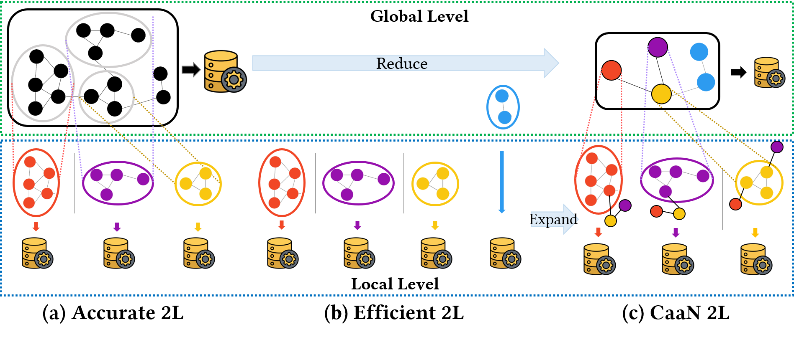

# Two-Level Graph Representation Learning with Community-as-a-Node Graphs

This paper has been submitted for publication in SIGMOD 2024.

*The basic concept of Two-Level GRL with Community-as-a-Node (CaaN 2L-GRL).*

## Abstract

> In this paper,we propose a novel graph representation learning (GRL) model, Two-Level GRL with Community-as-a-Node (simply, CaaN
2L-GRL). To achieve to improve both representation accuracy and learning efficiency, we first design a Two-Level GRL architecture
based on the partitioning of the graph: 1) local GRL on nodes within each partitioned subgraph and 2) global GRL on subgraphs. By partitioning
the graph through community detection, we focus on each community individually and enable elaborate node learning
in the same community. Based on Two-Level GRL, we propose an abstracted graph, Community-as-a-Node Graph (simply, CaaN), to
effectively maintain the high-level structure while dramatically reducing the size of the graph. By applying the CaaN graph to
local and global GRLs, we propose CaaN 2L-GRL that effectively maintains the global structure of the entire graph while accurately
representing the nodes in each community. A salient point of the proposed model is that it can improve performance in terms of
both accuracy and efficiency by being applied to any existing GRL model. Through extensive experiments, we show that CaaN 2L-GRL
outperforms the existing models in both accuracy and efficiency. To show the coverage of our model, we adopt a total of seven GRL
models including the widely used and latest models. Specifically, in link prediction, CaaN 2L-GRL significantly improves the AUC
value of the existing GRL models by up to 12.47% and reduces their learning time by up to 48.10%. In node classification, CaaN 2L-GRL
improves the accuracy of the existing GRL models by up to 15.68% and reduces their learning time by up to 42.79%. Furthermore, we
verify the scalability of our model with respect to dataset size and the number of CPU cores, as well as its representation effectiveness
and efficiency compared to the existing graph partitioning algorithm. 

## Implementation

In experiments, the source code for the three baseline models: [CNRL](https://arxiv.org/abs/1611.06645), [AnECI](https://ieeexplore.ieee.org/document/9835662), [GCA](https://dl.acm.org/doi/abs/10.1145/3442381.3449802)

is in the folders `models/CNRL`, `models/AnECI`, and `models/GCA`, respectively.

For a detailed description of running the model, see the original GitHub repository.

1. [CNRL](http://nlp.csai.tsinghua.edu.cn/%7Etcc/datasets/simplified_CNRL.zip) (TKDE 2018)

2. [AnECI](https://github.com/Gmrylbx/AnECI) (ICDE 2022)

3. [GCA](https://github.com/CRIPAC-DIG/GCA) (WWW 2021)

All other source codes in the paper are in the `codes` folder.

## Dataset

Dataset used in this study is provided in `datasets`

1. [Foursquare](https://sites.google.com/site/yangdingqi/home/foursquare-dataset)

2. [Flickr](https://www.kaggle.com/datasets/hsankesara/flickr-image-dataset)

Other datasets (PubMed and CiteSeer) can be obtained from [stellargraph library](https://stellargraph.readthedocs.io/en/v0.9.0/_modules/stellargraph/datasets/datasets.html). 

## Getting the code

You can download a copy of all the files in this repository by cloning the
[git](https://git-scm.com/) repository:

    https://github.com/parkjungha/Two-level-GRL.git

or download a zip archive.

## Dependencies

You'll need a working Python environment to run the code.
The recommended way to set up your environment is through the
[Anaconda Python distribution](https://www.anaconda.com/download/) which
provides the `conda` package manager.
Anaconda can be installed in your user directory and does not interfere with
the system Python installation.
The required dependencies are specified in the file `environment.yml`.

We use `conda` virtual environments to manage the project dependencies in
isolation.
Thus, you can install our dependencies without causing conflicts with your
setup (even with different Python versions).

Run the following command in the repository folder (where `environment.yml`
is located) to create a separate environment and install all required
dependencies in it:

    conda env create
    source activate [name]
    conda env export > environment.yaml

## Environments

We use Intel Xeon Silver 4210R 20-core CPU @ 2.40 GHz and 32 GB RAM running on Ubuntu 18.04.6 LTS.

### Prerequisite
- Python (version 3.6.13)
- iGraph Python library (version 0.9.9)
- StellarGraph library (version 1.2.1)
- TensorFlow Keras (version 2.6.2)
- Gensim (version 4.1.2)

## Reproducing the results

All codes are all run inside [Jupyter notebooks](http://jupyter.org/) yet in the `codes` folder.

We will update by creating python scripts to automate our proposed model soon. 

